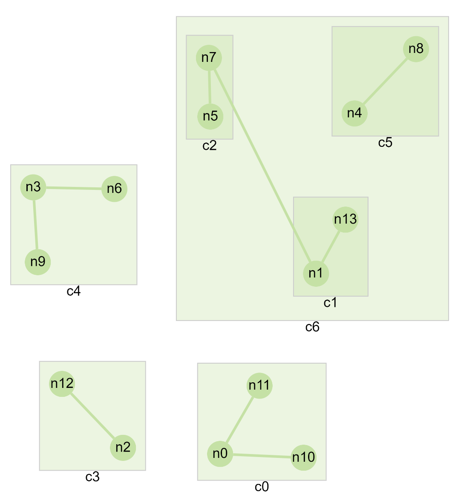

cytoscape-layvo
================================================================================

## Description

Layout quality evaluation tool ([demo](https://ghcdn.rawgit.org/iVis-at-Bilkent/cytoscape.js-layvo/unstable/demo/demo2.html))

## Dependencies

 * Cytoscape.js ^3.2.0

## Usage instructions

Download the library:
 * via npm: `npm install cytoscape-layvo` , 
 * via bower: `bower install cytoscape-layvo` , or
 * via direct download in the repository (probably from a tag).

Import the library as appropriate for your project:

ES import:

``` js
import cytoscape from 'cytoscape';
import layvo from 'cytoscape-layvo';

cytoscape.use(layvo);
```

CommonJS require:

``` js
let cytoscape = require('cytoscape');
let layvo = require('cytoscape-layvo');

cytoscape.use(layvo); // register extension
```

AMD:

``` js
require(['cytoscape', 'cytoscape-layvo'], function(cytoscape, layvo) {
    layvo(cytoscape); // register extension
});
```

Plain HTML/JS has the extension registered for you automatically, because no `require()` is needed.

## API

* `let api = cy.layvo('get')`: get the extension instance
* `api.generalProperties()`: get general layout metrics

returns object like 

``` 
{

    "numberOfEdgeCrosses": 4,
    "numberOfNodeOverlaps": 0,
    "totalArea": 547324,
    "totalEdgeLength": 4014.5816312531915,
    "averageEdgeLength": 573.5116616075987

}
```

* `api.saveLayoutData()`: saves position data for each node by respecting the hierarchy of parent and child. This must be called before calling `getMeanAngleDiff` and `getMeanPositionDiff`. This only saves the state, doesn't return anything.

* `api.getMeanAngleDiff()`: returns the mean difference of angle between 2 layouts. The first layout is saved when `saveLayoutData` called. Angle differences are calculated from each PAIR of nodes that are either inside the same graph or inside the same compound node.

* `api.getMeanPositionDiff()`: returns the mean difference of positions between 2 layouts. The first layout is saved when `saveLayoutData` called. Position differences are calculated from each PAIR of nodes that are either inside the same graph or inside the same compound node.

<p align="center">

</p>

For example, for the graph above there are certain groups of nodes such as 
{c0, c1, c3, c4}, {n0, n11, n10}, {n2, n12}, {n3, n6, n9}, {c1, c2, c5}, {n1, n13}, {n5, n7}, {n4, n8}.  During calculations of `getMeanAngleDiff` and `getMeanPositionDiff` every possible pair is generated within these groups.

## Build targets

* `npm run test` : Run Mocha tests in `./test`
* `npm run build` : Build `./src/**` into `cytoscape-layvo.js`
* `npm run watch` : Automatically build on changes with live reloading (N.b. you must already have an HTTP server running)
* `npm run dev` : Automatically build on changes with live reloading with webpack dev server
* `npm run lint` : Run eslint on the source

N.b. all builds use babel, so modern ES features can be used in the `src` .

## Publishing instructions

This project is set up to automatically be published to npm and bower.  To publish:

1. Build the extension : `npm run build:release`
1. Commit the build : `git commit -am "Build for release"`
1. Bump the version number and tag: `npm version major|minor|patch`
1. Push to origin: `git push && git push --tags`
1. Publish to npm: `npm publish .`
1. If publishing to bower for the first time, you'll need to run `bower register cytoscape-layvo https://github.com/iVis-at-Bilkent/cytoscape-layvo.git`
1. [Make a new release](https://github.com/iVis-at-Bilkent/cytoscape-layvo/releases/new) for Zenodo.
